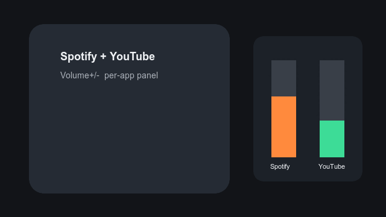

# App Volume (VolumeManager)

**Volume+/− → floating overlay with per-app volume sliders** for apps that are playing audio.

Requires **Android 13+** and **Magisk/root** or **Sui/Shizuku**. One APK includes both backends.



Downloads: [Releases](https://github.com/lnked/volumeManager/releases).

---

## Установка (с телефона)

1. Скачай `app-release.apk` из [последнего релиза](https://github.com/lnked/volumeManager/releases/latest).
2. (Опционально для root) Magisk-модуль `volumemanager_root-v*.zip`.
3. Установи APK → открой приложение → пройди чеклист (backend → спец. возможности).

### A) Magisk / root

1. Magisk → Modules → `volumemanager_root-v*.zip` → **Reboot**.
2. В приложении: **Magisk / root** → «Выдать root» → su в Magisk.
3. «Открыть спец. возможности» → включи сервис.
4. Volume+/− → overlay.

### B) Sui / Shizuku

1. **Sui** ([RikkaApps/Sui](https://github.com/RikkaApps/Sui)) или классический **Shizuku** (Start после каждой перезагрузки).
2. В приложении: **Sui / Shizuku** → «Выдать / открыть Sui» → разреши.
3. Спец. возможности → Volume+/−.

Без привилегий overlay показывает только общий `STREAM_MUSIC`. Игры схлопываются в один слайдер «Игры».

ADB:

```bash
adb install -r app-release.apk
```

---

## Сборка

```bash
./gradlew :app:assembleRelease
# app/build/outputs/apk/release/app-release.apk

./gradlew :app:assembleDebug
# app/build/outputs/apk/debug/app-debug.apk
```

Magisk zip (для root-пути):

```bash
bash magisk/package-zip.sh
# out/volumemanager_root-v1.0.0.zip
```

Release: R8 minify + shrinkResources.

---

## Smoke-test

1. Spotify + YouTube → два слайдера.
2. Несколько игр → одна колонка «Игры».
3. Переключение Root ↔ Sui в настройках без переустановки.

## Ключевые пути

- `magisk/` — Magisk-модуль (`volumemanager_root`)
- `app/src/main/.../root/` — libsu RootService
- `app/src/main/.../shizuku/` + `privileged/` — Shizuku/Sui UserService
- `app/src/main/.../DualVolumeController.kt` — выбор backend
- `app/src/main/.../a11y|overlay|data` — shared UI
